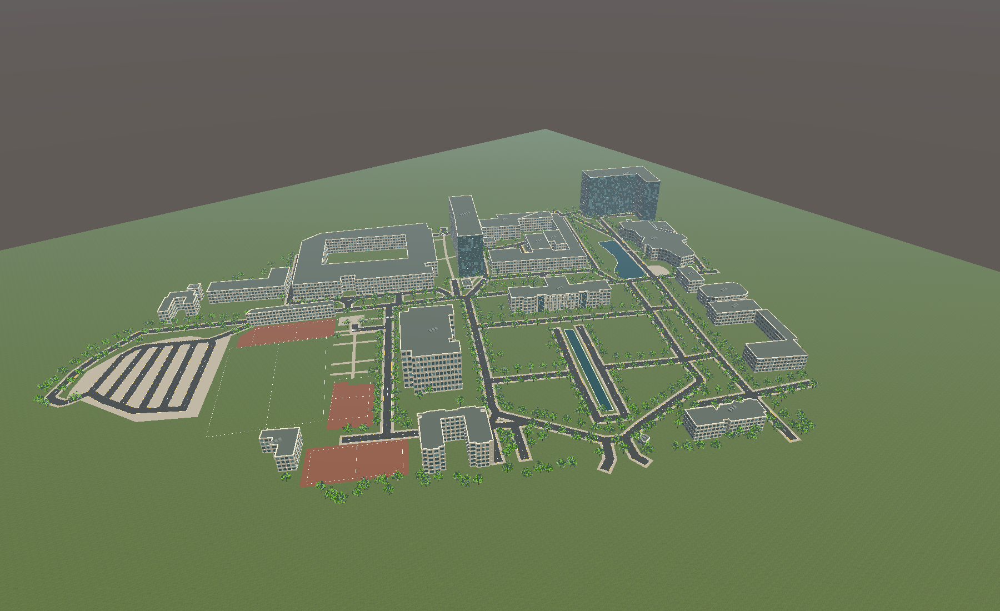

# inha-autonomous-mobility
인하대학교 교내 자율주행 운송 서비스 / Inha University Autonomous Campus Mobility Service

프로젝트 버전: **0.1.1.0**. [통합 개발 규칙](AGENTS.md), [지도 작업 현황](Docs/MapResearch/PLAN.md), [PC·모바일 UI 명세](Docs/ClientUI/REQUIREMENTS.md), [화면별 적용·검증 계획](Docs/ClientUI/IMPLEMENTATION.md)을 기준으로 개발합니다. 클라이언트 UI와 Python 서버는 구현 예정이며, 아래 환경 맵 안내와 구분합니다.

## Unity 프로젝트 실행

1. Git LFS를 설치한 뒤 이 저장소를 복제합니다. 기존 복제본에서는 `git lfs pull`을 실행하세요.
2. Unity Hub에서 저장소 폴더를 추가하고 **Unity 6000.3.21f1**로 엽니다.
3. `Assets/InhaCampus/InhaCampus.unity`를 엽니다.

현재 구현은 인하대학교 환경 맵입니다. 플레이어, 차량, 사람, UI는 포함하지 않습니다.
다른 씬에서 사용할 수 있는 환경 프리팹은 `Assets/InhaCampus/InhaCampusMap.prefab`입니다.

건물 및 도로 배치는 실제 지도 좌표를 사용하며, 외관·높이·수목은 근사 모델입니다. 지형 고저차는 미반영입니다.
[맵 구성, 검증 및 재생성 안내](Docs/AI/InhaCampus.md)를 참고하세요.

## 데이터 출처

코드에는 저장소의 MIT 라이선스가 적용됩니다. OpenStreetMap 지도 데이터 및 파생 지리 데이터에는 별도로 **ODbL 1.0**이 적용됩니다.
© [OpenStreetMap contributors](https://www.openstreetmap.org/copyright).
[지도 데이터 출처](Assets/InhaCampus/Source/ATTRIBUTION.txt)를 유지해 주세요.
